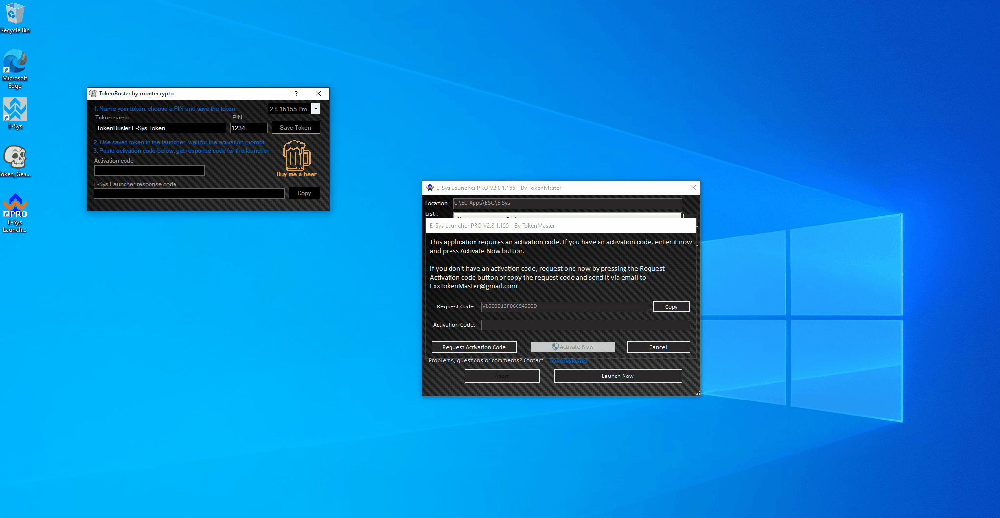

# Generating ESYS Token

First, open Token Generator. A window will open up stating it is malicious, but it is not. Click more info, then run.  Now, click save token and remember where it is saved.

<figure><figcaption></figcaption></figure>

Now, first open the esys launcher pro you had installed. Click the plus button on the side, and allow it to navigate to the default directory. If it didn't, you can use the one in the gif. Afterwards, click the 3 dots at the end of the est path button, and navigate to the documents folder and click the token. Then, type the pin from the TokenBuster into the launcher.&#x20;

<figure><figcaption></figcaption></figure>

Now you are able to click launch now, A window will open up for activation. Copy the request code from esyslauncher and paste it into the activation code box in TokenBuster. From here, copy the response code and paste it into the activation code box in esys launcher. Click activate, then click launch esys again.

<figure><figcaption></figcaption></figure>

After ESYS opens, click private networks, then allow access. In esys, click ok and you can close it.

<figure><figcaption></figcaption></figure>

* You may need to repeat these steps in the future if esys resets.
* Congrats! Esys is fully up and ready! Now we can install the PSDZ Data&#x20;
