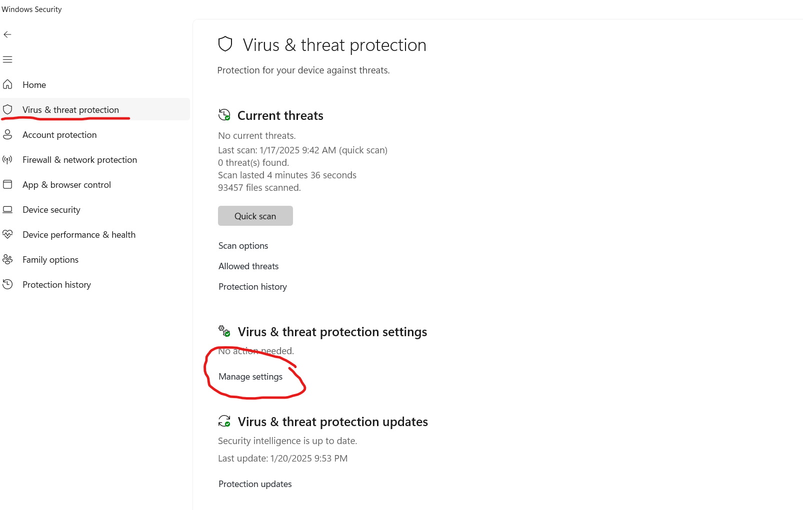

# Disable Antivirus

Any antivirus including windows defender believes that the patching tool for esys is a virus. Windows believes the behavior of the program is malicious, however we intend for it to patch the software. This is NOT a virus.

How to disable windows defender :&#x20;

First, open the windows security app through the windows button :&#x20;

<figure><figcaption></figcaption></figure>

Next, navigate to the virus and threat protection window, then click manage settings :

<figure><figcaption></figcaption></figure>

From here, turn off real time Protection :

<figure><figcaption></figcaption></figure>
