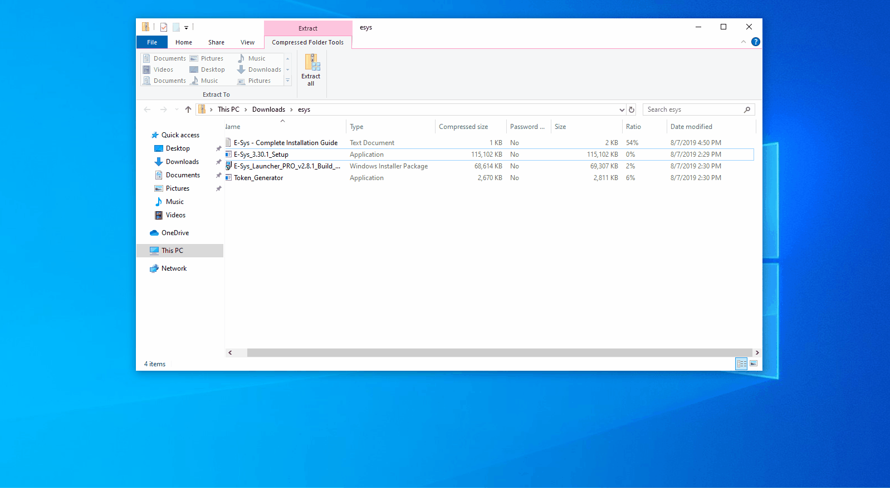
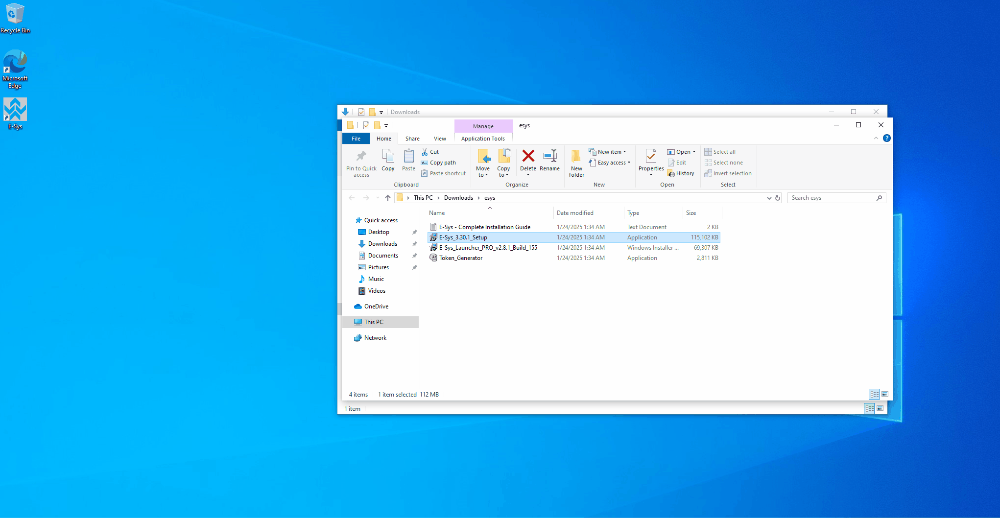

# Download

Link : [https://mega.nz/file/bQVjiT6K#VmaIia4fScsc-FM3AdK8NrpIlarzYqPIsfSe-fq-L5I](https://mega.nz/file/bQVjiT6K#VmaIia4fScsc-FM3AdK8NrpIlarzYqPIsfSe-fq-L5I)\

After downloading this, open the file and double click the E sys Setup

Now click extract all then extract, After this, a new window will open up. Here, you want to click the Esys Setup file again. Detailed in the gif below

<figure><figcaption></figcaption></figure>

After this, move the generator to desktop and run the launcher pro build

<figure><figcaption></figcaption></figure>
